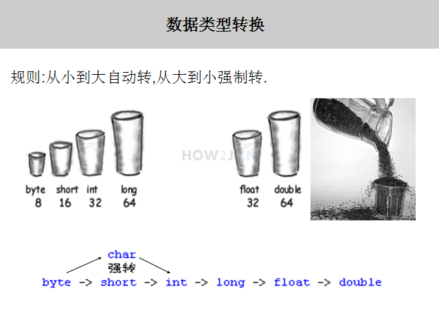
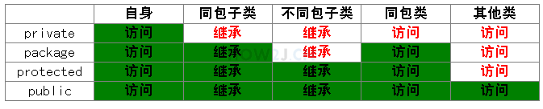

# JAVA SE
> 上完cs61b后，想系统地学jAVA SE，在how2j网站上，但是还是不够详细，不过作为一个人，对任何一个领域，怎么可能做到地毯式学习记录呢？慢慢来。

## 1，变量
> 定义是： 用来命名一个数据的标识符。year 这个标识符就是一个变量，它代表1949这个值
### 基本数据类型
* 整型：存放整数，一共有4🀄️：byte, short, int, long.区别在于不同的数据类型最大值最小值不一样。

<div align="center">
</img>
</div>

* 字符型：char类型用于存放一个字符，值用单引号'表示 (双引号表示字符串) **其长度和short一样，也是16位的**。只能存放一个字符，超过一个字符就会产生编译错误

* 浮点型：2种；float32位，double64位（默认），需要在数字后边加上f，声明是float型，所以，float f = 54.321会出现编译错误，因为54.321的默认类型是 double，其类型 长度为64，超过了float的长度32。

* 布尔型：1位。

### 字面值
>创建一个Hero对象会用到new关键字，但是给一个基本类型变量赋值却不是用new.   
因为基本类型是Java语言里的一种内置的特殊数据类型，并不是某个类的对象。  
给基本类型的变量赋值的方式叫做字面值

* 整数字面值：当以l或者L结尾的时候，一个整数字面值是long类型，否则就是int类型。  
byte,short,int和long的值都可以通过int类型的字面值来创建。整数的字面值可以用十进制，16进制，8进制和2进制表示。

* 浮点数字面值：当以f或者F结尾的时候，就表示一个float类型的浮点数，否则就是double类型。  
浮点数还可以用E或者e表示（科学计数法）。e2表示10的二次方，即100

* 字符的字面值放在单引号中。

### 类型转换
#### 转换规则
精度高的数据类型就像容量大的杯子，可以放更大的数据  
精度低的数据类型就像容量小的杯子，只能放更小的数据  
小杯子往大杯子里倒东西，大杯子怎么都放得下  
大杯子往小杯子里倒东西，有的时候放的下，有的时候就会有溢  
short 和char虽然都是16位，但是依旧需要强转
<div align="center">
</img>
</div>

#### 大精度到小精度

低精度向高精度转换，可以直接转：
```
        long l = 50;
        int i = 50;
        //int比较小，要放进比较大的long,随便怎么样，都放的进去
        l = i;
  ```
  反过来，强转：强制转换的意思就是，转是可以转的，但是不对转换之后的值负责。 风险自担，后果自负。
  
  b = (byte) i1，在前边用（）写上目标类型。
  
 ### 作用域
 
* 字段、属性、field：被声明在类下面，其作用域就是从其声明的位置开始的整个类。
* 参数：是声明在一个方法上的，就叫做参数。就是方法中被传入的参数：比如： int n 中的n。参数的作用域即为该方法内的所有代码。
* 局部变量：声明在方法内的变量，其作用域在声明开始的位置，到其所处于的块结束位置。
* final型变量：只能被赋值一次。

## 2，操作符

### 算术操作符
如果有任何运算单元的长度超过int,那么运算结果就按照最长的长度计算。如果任何运算单元的长度都不超过int,那么运算结果就按照int来计算。

i++; 先取值，再运算。++i; 先运算，再取值。

### 关系操作符

### 逻辑操作符

* 长路与 & 和 短路与 && ：两者唯一的区别是：长路与 两侧，都会被运算。短路与 只要第一个是false，第二个就不进行运算了。剩下的完全一样。
* 长路或 | 和 短路或 || ：同上：长路或  无论第一个表达式的值是true或者false,第二个的值，都会被运算，只要第一个表达式的值是true的，第二个表达式的值，就不需要进行运算了。

* 取反 ！
* 异或：^。不同，返回真。相同，返回假。

### 位操作符
> 待补充。

### 三元操作符
表达式?值1:值2：如果表达式为真 返回值1，为假，返回值2.

## 3，控制流程
> 即 if-else, while,for这些，所以只记录自己此时不会的。
### switch
```
 switch(day){
            case 1:
                System.out.println("星期一");
                break;
            case 2:
                System.out.println("星期二");
                break;
            case 3:
                System.out.println("星期三");
                break;
            case 4:
                System.out.println("星期四");
                break;
            case 5:
                System.out.println("星期五");
                break;
            case 6:
                System.out.println("星期六");
                break;
            case 7:
                System.out.println("星期天");
                break;
            default:
                System.out.println("这个是什么鬼？");
        }
```
**每个表达式结束，都应该有一个break;**
switch可以使用byte,short,int,char,String,enum,enum是枚举类型(日后）

### while
do-while:无论条件是否为真，都先执行一次，然后再判断条件，是否进入循环。
```
do{
} while（条件）
```
### continue
跳过continue后边的代码，不执行，进入下一次的循环。

### 结束外部循环
break只能结束一层的循环，跳出外部，有两种方法：
* 借助boolean变量结束外部循环:跳出内部之前，修改该boolean，每次内部循环结束，都判断下该boolean，如果满足，再次执行break,跳出外部。
* 在外部循环的前一行，加上标签，在内部循环break的时候使用该标签，能达到结束外部循环的效果：**outloop：**，**break outloop；**

## 4，Arrays:
* 数组复制：copyOfRange：int[] b = Arrays.copyOfRange(a, 0, 3); 第一个是源数组，第二个是起点，取得到，第三个是终点取不到。
* 转换为字符串：String content = Arrays.toString(a);
* 排序：Arrays.sort(a);
* 搜索某元素出现的位置：需要注意的是，使用binarySearch进行查找之前，必须使用sort进行排序，如果数组中有多个相同的元素，查找结果是不确定的。Arrays.binarySearch(a, 62)
* 填充：Arrays.fill(a, 5);使用同一个值，填充整个数组。

## 5，类和对象
### 引用：
>如果一个变量的类型是 类类型，而非基本类型(primary type)，那么该变量又叫做引用。(reference)

Hero h = new Hero();

创建一了Hero对象，h这个变量是Hero类型，又称为“引用”，=使得h这个引用指向右侧创建的对象。有时候，引用有多个，但是对象只有一个。但是，一个引用同一时间只能指向一个对象。
### this
this代表当前对象：
* 通过this 访问属性。在方法中，当参数名和方法名一样时，只能访问到参数name，所以参数名不得不使用其他名字。或者，可以使用this.name代表属性名，name代表参数名。
* 通过this调用其他的构造方法：如果要在一个构造方法中，调用另一个构造方法，可以使用this()。（构造函数的重载overload)
### 访问修饰符
#### 类之间的关系：
* 自身：hero类
* 同包子类：ADHero这个类是Hero的子类，并且和Hero处于同一个包下
* 不同包子类：Support这个类是Hero的子类，但是在另一个包下
* 同包类：在一个包下，但是没有继承关系
* 其他类：Item这个类，在不同包，也没有继承关系的类
#### private
私有的，只有自身可以访问
#### 无修饰符
没有修饰符即代表package/friendly/default（？
同包的子类或无关类都可以access
#### protected
比无修饰符的又多了一点：同包的类、不同包的子类都可以访问。
#### public
所有的类都可以access

红色表示不可以访问或者继承，绿色代表可以。
<div>
</img>
</div>
#### 如何选择
属性通常用private封装，方法一般使用public被调用，会被子类继承的方法，通常使用protected。

### 类属性
> 当一个属性被static修饰时，叫做类属性，或者静态属性。对于类属性，所有的对象都共享一个值。对象属性：又叫实例属性、非静态属性。
#### 访问类属性
有两种方式：1，对象.属性；2，类.属性；但是建议使用第二种 类.类属性 的方式进行，这样更符合语义上的理解,访问即修改和获取。
### 类方法
> 类方法： 又叫做静态方法。对象方法： 又叫实例方法，非静态方法。访问一个对象方法，必须建立在有一个对象的前提的基础上。访问类方法，不需要对象的存在，直接就访问。所以访问静态方法可以通过null。
#### 调用类方法
同理，两种方法，1. 对象.类方法。2. 类.类方法。但是建议使用第二种 类.类方法 的方式进行，这样更符合语义上的理解。很多时候是没有实例的，Math.random()。

* 如果在某个方法中调用了**对象属性**，只有存在具体的对象的时候才有意义，那么设计为对象方法比较好。
* 静态方法只能访问静态、局部定义的属性或者静态方法.
* 但是，可以通过将参数的形式，将一个该类的引用传入到该静态方法中，或者在静态方法内部实例化一个对象，通过对象访问非静态方法。
```
        public void die(){
            hp = 7;
        }

        //类方法，静态方法
        //通过类就可以直接调用
        public static void battleWin(Hero s){//方法一
            System.out.println("battle win");
            Hero h = new Hero();//方法二
            h.name = "yaorui";
            h.die();
            System.out.println(h.hp);
            System.out.println(s.hp);
            System.out.println("如果输出了说明这样可以访问非静态");
        }
```

### 属性初始化
#### 对象属性初始化
有三种，按照优先级：
* 1，构造函数初始化
* 2，初始化快
```
{
        maxHP = 200; //初始化块
    }  
```
* 3，在声明的时候初始化

#### 类属性初始化
有两种:
* 1, 静态块
```
static{
        itemCapacity = 6;//静态初始化块 初始化
    }
```
* 2,声明的时候初始化

### 单例模式
> 单例模式又叫做 Singleton模式，指的是一个类，在一个JVM里，只有一个实例存在
#### 什么是单例模式？
回答的时候，要答到三元素
1. 构造方法私有化  
2. 静态属性指向实例  
3. public static的 getInstance方法，返回第二步的静态属性  
#### 饿汉式单例模式
通过私有化private 其构造方法，使得外部无法通过new 得到新的实例。在类的内部声明一个静态属性，指向这个对象。

提供了一个public static的getInstance方法，**外部调用者通过该方法获取12行定义的对象，而且每一次都是获取同一个对象**。 从而达到单例的目的。这种单例模式又叫做饿汉式单例模式，无论如何都会创建一个实例

```
package charactor;
 
public class GiantDragon {
 
    //私有化构造方法使得该类无法在外部通过new 进行实例化
    private GiantDragon(){
         
    }
 
    //准备一个类属性，指向一个实例化对象。 因为是类属性，所以只有一个
 
    private static GiantDragon instance = new GiantDragon();
     
    //public static 方法，提供给调用者获取12行定义的对象
    public static GiantDragon getInstance(){
        return instance;
    }
     
}
```
#### 懒汉式单例模式
只有在外部使用者调用getInstance的时候，才会创建实例.

根据代码，可以看到，静态属性在声明时未被初始化，为null，只有外部调用getInstance的时候，才实例化，之后再被调用，就会返回该静态属性指向的同一个对象。
```
package charactor;
 
public class GiantDragon {
  
    //私有化构造方法使得该类无法在外部通过new 进行实例化
    private GiantDragon(){       
    }
  
    //准备一个类属性，用于指向一个实例化对象，但是暂时指向null
    private static GiantDragon instance;
      
    //public static 方法，返回实例对象
    public static GiantDragon getInstance(){
        //第一次访问的时候，发现instance没有指向任何对象，这时实例化一个对象
        if(null==instance){
            instance = new GiantDragon();
        }
        //返回 instance指向的对象
        return instance;
    }
      
}
```
### 枚举类型
枚举enum是一种特殊的类(还是类)，使用枚举可以很方便的定义常量。比如设计一个枚举类型 季节，里面有4种常量。
```
public enum Season {
    SPRING,SUMMER,AUTUMN,WINTER
}
```
#### 遍历枚举
Season.values()
```
for (Season s : Season.values()) {
            System.out.println(s);
        }
```

## 6,接口与继承/interface and extends

### 接口
> 接口就像是一种约定，我们约定某些英雄是物理系英雄，那么他们就一定能够进行物理攻击。
设计一类英雄，能够使用物理攻击，这类英雄在LOL中被叫做AD 类：ADHero。继承了Hero 类，所以继承了name,hp,armor等属性。

**实现了AD这个接口，就必须提供AD接口中声明的方法physicAttack()，实现在语法上使用关键字 implements**

同理，可以设计一类英雄，只能使用魔法攻击，这类英雄在LOL中被叫做AP 类：APHero继承了Hero 类，所以继承了name,hp,armor等属性。

设计一类英雄，既能进行物理攻击，又能进行魔法攻击：**即实现多个接口：**

```
package charactor;
  
//同时能进行物理和魔法伤害的英雄
public class ADAPHero extends Hero implements AD,AP{//直接在implements后边加上接口名，用逗号隔开。
  
    @Override
    public void magicAttack() {
        System.out.println("进行魔法攻击");
    }
  
    @Override
    public void physicAttack() {
        System.out.println("进行物理攻击");
    }
  
}
```
### 对象转换
#### 引用类型与对象类型
> ADHero ad = new ADHero();  
在这个例子中，有一个对象 new ADHero(), 同时也有一个引用ad。  
对象的类型是ADHero，引用的类型也是ADHero。  
引用类型和对象类型是一样的。
#### 子类转父类/接口(向上转型)
当引用类型和对象类型不一致的时候，才需要进行类型转换

就是cs61b里面is a的问题，把右边的当做左边来用，看说得通不。**所有的子类转换为父类，都是说得通的**

#### 父类/接口转子类(向下转型)
父类转子类，有的时候行，有的时候不行，所以必须进行**强制转换。**
```
 Hero h =new Hero();
 ADHero ad = new ADHero();
 h = ad;
 ad = (ADHero) h;
```
第三行子类转父类，直接转换    
第四行，强制转换，**可行：因为，此时h已经指向了ad这个引用指向的ADHero对象，所以可以转换成功**

h引用有可能指向一个ad对象，也有可能指向一个support对象,所以把h引用转换成AD类型的时候，就有可能成功，有可能失败。因此要进行强制转换，换句话说转换后果自负。到底能不能转换成功，**要看引用h到底指向的是哪种对象，h指向的是一个ad对象，所以转换成ADHero类型，是可以的**

```
Support s =new Support();
h = s;
ad = (ADHero)h;
````
第二行：把一个support对象当做Hero使用，一定可以  
第三行：h指向的是一个support对象，所以转换成ADHero类型，会失败。失败的表现形式是抛出异常 ClassCastException 类型转换异常。

#### 没有继承关系
没有继承关系的两个类相互转换一定会失败：虽然ADHero和APHero都继承了Hero，但是彼此没有互相继承关系。

#### 类转换成接口(向上转型)
```
ADHero ad = new ADHero();        
AD adi = ad;//adi指向了ADHero()这个新创建的对象
//向下：
ADHero adHero = (ADHero) adi;
ADAPHero adapHero = (ADAPHero) adi;
```
把一个ADHero类型转换为AD接口，向上转换，而AD接口只有一个physicAttack方法，这就意味着转换后就有可能要调用physicAttack方法，而ADHero一定是有physicAttack方法的，所以转换是能成功的。

比如函数参数是一个接口，但是实参确实接口的实现类，这就是一个典型的向上转型。
        
#### 接口转换成实现类(向下转型)
**所有的向下转型：向下转型必须要先向上转型。必须先由子类向上转成父类，才能再由父类向下转成子类，不能直接拿一个new出来的父类直接转化成子类**

第三行的向下转换：adi实际上是指向一个ADHero的，所以能够转换成功  
第四行：adi引用所指向的对象是一个ADHero，要转换为ADAPHero就会失败。

#### instanceof
测试它左边的一个引用所指向的对象是否是它右边的类的实例，返回 boolean 的数据类型。

返回true的情况：
* a对象是B类型的一个实例化对象
* a对象是B类型直接或间接**子类的对象**
* a对象所属的类型直接或间接实现了B接口。

### 重写/override
子类在继承父类后，重复提供该方法，就叫做方法的重写。

### 多态/Polymorphism
> 多态是同一个行为具有多个不同表现形式或形态的能力。

#### 操作符的多态
同一个操作符在不同情境下，具备不同的作用。

比如，如果+号两侧都是整型，那么+代表 数字相加。如果+号两侧，**任意一个**是字符串，那么+代表字符串连接。
```
int a = 50;
String b = "s";
String c = a+b; //如果+号两侧，任意一个是字符串，那么+代表字符串连接
System.out.println(c);
```
输出的为50s，是个字符串！！！

#### 类的多态
父类引用指向子类对象：Item i1= new LifePotion();。

需要如下条件：
* 继承
* 父类（接口）引用指向子类对象。
* 调用的方法有重写，这样调用同一个方法时，才会有不同的状态。

### 隐藏
> 与重写类似，方法的重写是子类覆盖父类的**对象方法**。隐藏，就是子类覆盖父类的**类方法**。所以和override是一样的，都是子类覆盖父类。

父类和子类拥有相同名字的属性或者方法（ 方法隐藏只有一种形式，就是父类和子类存在相同的静态方法）时，父类的同名的属性或者方法形式上不见了，实际是还是存在的。

### super
#### 一个显式提供无参的构造方法的父类：
public Hero(){
##### 实例化子类，父类的构造方法一定会被调用
实例化一个ADHero(), 其构造方法会被调用，其父类的构造方法也会被调用，并且是父类构造方法先调用

#### 父类显式提供两个构造方法：
无参的构造方法和带一个参数的构造方法。
##### 子类显式调用父类带参构造方法
关键字super 显式调用父类带参的构造方法，super(name);

**当父类只有有参构造函数的时候：**

作为子类，无论如何 都会调用父类的构造方法。默认情况下，会调用父类的无参的构造方法。但是，当父类没有无参构造方法的时候(提供了有参构造方法，并且不显示提供无参构造方法)，子类就会抛出异常，因为它尝试去调用父类的无参构造方法。这个时候，**必须通过super去调用父类声明的、存在的、有参的构造方法。**

#### 调用父类属性和方法。
通过super调用父类的moveSpeed属性，使用this调用自身的moveSpeed属性：this.moveSpeed; super.moveSpeed;

方法：super.useItem(i);

### object
> 所有类的父类。

### final
> final修饰类，方法，基本类型变量，引用的时候分别有不同的意思。
#### 修饰类
> public final class Hero extends Object {}

类被修饰为final时，该类是无法被继承的。其子类会出现编译错误。

#### 修饰方法
> public final void useItem(Item i){}

hero的方法useItem()被修饰为final，所以ADhero不能override该方法。

#### 修饰基本类型变量
表示该变量只有一次赋值机会

#### 修饰引用
表示该引用只有1次指向对象的机会

#### public static final int num = 6
public static final结合在一起，定义：以公开，直接访问，不会变化的值的常量。

### 抽象类/abstract
#### 抽象方法
如果你想设计这样一个类，该类包含一个特别的成员方法，该方法的具体实现由它的子类确定，那么你可以在父类中声明该方法为抽象方法。**抽象方法只包含一个方法名，而没有方法体。**

**任何子类必须重写父类的抽象方法，或者声明自身为抽象类。**

改变之前的思路，把hero声明为abstract的，并为Hero增加一个抽象方法 attack，**public abstract void attack();注明为 adstract的方法**

APHero,ADHero,ADAPHero是Hero的子类，继承了Hero的属性和方法。但是各自的攻击手段是不一样的，所以继承Hero类后，再各自实现具体的attack()方法。

#### 抽象类可以没有抽象方法
虽然没有抽象方法，但是一旦被声明为了抽象类，就不能够直接被实例化名，所以抽象类必须被继承，才能被使用

#### 与接口的区别
* 子类只能继承一个抽象类，子类可以实现多个接口。
* 抽象类可以定义public,protected,package,private 静态和非静态属性，final和非final属性。但是接口中声明的属性，只能是public，静态，final的。
* 抽象类和接口都可以有实体方法。 接口中的实体方法，叫做[默认方法]()

### 内部类
#### 成员内部类
可以直接使用外部类的所有成员和方法，即使是private的，同时外部类要访问内部类的所有成员变量/方法，则需要通过内部类的对象来获取：
```
public class Outer { 
    public class Inner { 
        public void print(String str) { 
            System.out.println(str); 
        } 
    } 
 
    public Inner getInner() { 
        return new Inner(); 
    } 
  
    public static void main(String[] args) { 
        Outer outer = new Outer(); 
        Outer.Inner inner = outer.new Inner(); //创建方法
        inner.print("Outer.new"); //通过实例化一个内部类inner对象来访问内部类的方法print();
 
        inner = outer.getInner(); 
        inner.print("Outer.get"); 
    } 
}
```
成员内部类不能含有static的变量和方法。因为**成员内部类需要先创建了外部类，才能创建它自己的。只有一个外部类对象存在的时候，才有意义**。在成员内部类要引用外部类对象时，使用**外部类名.this，Outer.this**来表示外部类对象；创建内部类时，使用：**外部类的名称.内部类的名称 内部类的引用obj = 外部类的引用（outerobj）.new Inner()** 因为内部类的构造函数也是在外部类的内部，所以使用.调用该构造函数。

#### 局部内部类
定义在一个方法或者一个作用域里面的类，它和成员内部类的区别在于**局部内部类的访问仅限于方法内或者该作用域内。**

局部内部类就像是**方法里面的一个局部变量一样，是不能有public、protected、private以及static修饰符的。**
```
class People{
    public People() {
         
    }
}
 
class Man{
    public Man(){
         
    }
     
    public People getWoman(){
        class Woman extends People{   //局部内部类,在外部类Man的方法getWoman()内部定义的
            int age =0;
        }
        return new Woman();
    }
}
```
#### 静态内部类
在一个类里面声明一个静态内部类，静态内部类是不需要依赖于外部类的。

这点和类的静态成员属性有点类似，并且**它不能使用外部类的非static成员变量或者方法**，这点很好理解，因为在没有外部类的对象的情况下，可以创建静态内部类的对象，如果允许访问外部类的非static成员就会产生矛盾，因为外部类的非static成员必须依附于具体的对象。
```
class Outter {
    public Outter() {
         
    }
     
    static class Inner {
        public Inner() {
             
        }
    }
}
```
#### 匿名内部类
匿名内部类是没有名字的内部类，因为没有名字，所以匿名内部类只能使用一次，它通常用来简化代码编写，使用匿名内部类有个前提条件：必须继承一个父类或实现一个接口。

##### 用于抽象类：
```
abstract class Person {
    public abstract void eat();
}
 
public class Demo {
    public static void main(String[] args) {
        Person p = new Person() {
            public void eat() {
                System.out.println("eat something");
            }
        };
        p.eat();
    }
}
```
我们直接将抽象类Person中的方法在大括号中实现了。这样便可以省略一个类的书写。

##### 用于接口：
```
interface Person {
    public void eat();
}
 
public class Demo {
    public static void main(String[] args) {
        Person p = new Person() {
            public void eat() {
                System.out.println("eat something");
            }
        };
        p.eat();
    }
}
```
##### Thread类的匿名内部类实现
匿名内部类最常用的情况就是在多线程的实现上，因为要实现多线程必须继承Thread类或者实现Runnable接口。
##### Runnable接口的匿名内部类实现

##### 匿名类的作用
* 一个类继承其他类或者实现接口，并不需要增加额外的方法，只是对继承方法的实现或是覆盖。
* 只是为了获得一个对象实例，不需要知道其实际类型。
* 类名没有意义，也就是不需要使用到。

### 默认方法
> Java 8 新增了接口的默认方法。默认方法就是**接口可以有实现方法，而且不需要实现类去实现其方法。**我们只需在方法名前面加个 default 关键字即可实现默认方法。
```
public interface Vehicle {
   default void print(){
      System.out.println("我是一辆车!");
   }
}
```
#### 多个默认方法
一个类实现了多个接口，且这些接口有相同的默认方法，解决方法：
1. 创建自己的默认方法，来覆盖重写接口的默认方法：
```
public class Car implements Vehicle, FourWheeler {
   default void print(){
      System.out.println("我是一辆四轮汽车!");
   }
}
```
2，使用super来调用指定接口的默认方法：
```
public class Car implements Vehicle, FourWheeler {
   public void print(){
      Vehicle.super.print();//会调用vehicle这个接口的默认方法
   }
}
```
### UML 图 —— 类之间的关系

## 7，数字与字符串
### 装箱与拆箱
#### 封装类
所有的基本类型都有对应的类类型，即封装类，比如，int对应Integer。
#### Number类
数字封装类有：Byte,Short,Integer,Long,Float,Double。（整型与浮点型）

