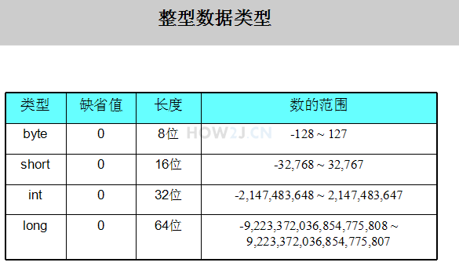

# JAVA SE

## 1，变量
> 定义是： 用来命名一个数据的标识符。year 这个标识符就是一个变量，它代表1949这个值
### 基本数据类型
* 整型：存放整数，一共有4🀄️：byte, short, int, long.区别在于不同的数据类型最大值最小值不一样。

<div align="center">
</img>
</div>

* 字符型：char类型用于存放一个字符，值用单引号'表示 (双引号表示字符串) **其长度和short一样，也是16位的**。只能存放一个字符，超过一个字符就会产生编译错误

* 浮点型：2种；float32位，double64位（默认），需要在数字后边加上f，声明是float型，所以，float f = 54.321会出现编译错误，因为54.321的默认类型是 double，其类型 长度为64，超过了float的长度32。

* 布尔型：1位。

### 字面值
>创建一个Hero对象会用到new关键字，但是给一个基本类型变量赋值却不是用new.   
因为基本类型是Java语言里的一种内置的特殊数据类型，并不是某个类的对象。  
给基本类型的变量赋值的方式叫做字面值

* 整数字面值：当以l或者L结尾的时候，一个整数字面值是long类型，否则就是int类型。  
byte,short,int和long的值都可以通过int类型的字面值来创建。整数的字面值可以用十进制，16进制，8进制和2进制表示。

* 浮点数字面值：当以f或者F结尾的时候，就表示一个float类型的浮点数，否则就是double类型。  
浮点数还可以用E或者e表示（科学计数法）。e2表示10的二次方，即100

* 字符的字面值放在单引号中。

### 类型转换
#### 转换规则
精度高的数据类型就像容量大的杯子，可以放更大的数据  
精度低的数据类型就像容量小的杯子，只能放更小的数据  
小杯子往大杯子里倒东西，大杯子怎么都放得下  
大杯子往小杯子里倒东西，有的时候放的下，有的时候就会有溢  
short 和char虽然都是16位，但是依旧需要强转
<div align="center">
</img>
</div>

#### 大精度到小精度

低精度向高精度转换，可以直接转：
```
        long l = 50;
        int i = 50;
        //int比较小，要放进比较大的long,随便怎么样，都放的进去
        l = i;
  ```
  反过来，强转：强制转换的意思就是，转是可以转的，但是不对转换之后的值负责。 风险自担，后果自负。
  
  b = (byte) i1，在前边用（）写上目标类型。
  
 ### 作用域
 
* 字段、属性、field：被声明在类下面，其作用域就是从其声明的位置开始的整个类。
* 参数：是声明在一个方法上的，就叫做参数。就是方法中被传入的参数：比如： int n 中的n。参数的作用域即为该方法内的所有代码。
* 局部变量：声明在方法内的变量，其作用域在声明开始的位置，到其所处于的块结束位置。
* final型变量：只能被赋值一次。

## 2，操作符

### 算术操作符
如果有任何运算单元的长度超过int,那么运算结果就按照最长的长度计算。如果任何运算单元的长度都不超过int,那么运算结果就按照int来计算。

i++; 先取值，再运算。++i; 先运算，再取值。

### 关系操作符

### 逻辑操作符

* 长路与 & 和 短路与 && ：两者唯一的区别是：长路与 两侧，都会被运算。短路与 只要第一个是false，第二个就不进行运算了。剩下的完全一样。
* 长路或 | 和 短路或 || ：同上：长路或  无论第一个表达式的值是true或者false,第二个的值，都会被运算，只要第一个表达式的值是true的，第二个表达式的值，就不需要进行运算了。

* 取反 ！
* 异或：^。不同，返回真。相同，返回假。

### 位操作符
> 待补充。

### 三元操作符
表达式?值1:值2：如果表达式为真 返回值1，为假，返回值2.

## 3，控制流程
> 即 if-else, while,for这些，所以只记录自己此时不会的。
### switch
```
 switch(day){
            case 1:
                System.out.println("星期一");
                break;
            case 2:
                System.out.println("星期二");
                break;
            case 3:
                System.out.println("星期三");
                break;
            case 4:
                System.out.println("星期四");
                break;
            case 5:
                System.out.println("星期五");
                break;
            case 6:
                System.out.println("星期六");
                break;
            case 7:
                System.out.println("星期天");
                break;
            default:
                System.out.println("这个是什么鬼？");
        }
```
**每个表达式结束，都应该有一个break;**
switch可以使用byte,short,int,char,String,enum,enum是枚举类型(日后）

### while
do-while:无论条件是否为真，都先执行一次，然后再判断条件，是否进入循环。
```
do{
} while（条件）
```
### continue
跳过continue后边的代码，不执行，进入下一次的循环。

### 结束外部循环
break只能结束一层的循环，跳出外部，有两种方法：
* 借助boolean变量结束外部循环:跳出内部之前，修改该boolean，每次内部循环结束，都判断下该boolean，如果满足，再次执行break,跳出外部。
* 在外部循环的前一行，加上标签，在内部循环break的时候使用该标签，能达到结束外部循环的效果：**outloop：**，**break outloop；**

## 4，Arrays:
* 数组复制：copyOfRange：int[] b = Arrays.copyOfRange(a, 0, 3); 第一个是源数组，第二个是起点，取得到，第三个是终点取不到。
* 转换为字符串：String content = Arrays.toString(a);
* 排序：Arrays.sort(a);
* 搜索某元素出现的位置：需要注意的是，使用binarySearch进行查找之前，必须使用sort进行排序，如果数组中有多个相同的元素，查找结果是不确定的。Arrays.binarySearch(a, 62)
* 填充：Arrays.fill(a, 5);使用同一个值，填充整个数组。

## 5，类和对象
### 引用：
>如果一个变量的类型是 类类型，而非基本类型(primary type)，那么该变量又叫做引用。(reference)

Hero h = new Hero();

创建一了Hero对象，h这个变量是Hero类型，又称为“引用”，=使得h这个引用指向右侧创建的对象。有时候，引用有多个，但是对象只有一个。但是，一个引用同一时间只能指向一个对象。
### this
this代表当前对象：
* 通过this 访问属性。在方法中，当参数名和方法名一样时，只能访问到参数name，所以参数名不得不使用其他名字。或者，可以使用this.name代表属性名，name代表参数名。
* 通过this调用其他的构造方法：如果要在一个构造方法中，调用另一个构造方法，可以使用this()。（构造函数的重载overload)
### 访问修饰符
#### 类之间的关系：
* 自身：hero类
* 同包子类：ADHero这个类是Hero的子类，并且和Hero处于同一个包下
* 不同包子类：Support这个类是Hero的子类，但是在另一个包下
* 同包类：在一个包下，但是没有继承关系
* 其他类：Item这个类，在不同包，也没有继承关系的类
#### private
私有的，只有自身可以访问
#### 无修饰符
没有修饰符即代表package/friendly/default（？
同包的子类或无关类都可以access
#### protected
比无修饰符的又多了一点：同包的类、不同包的子类都可以访问。
#### public
所有的类都可以access

红色表示不可以访问或者继承，绿色代表可以。
<div>
</img>
</div>
#### 如何选择
属性通常用private封装，方法一般使用public被调用，会被子类继承的方法，通常使用protected。

### 类属性
> 当一个属性被static修饰时，叫做类属性，或者静态属性。对于类属性，所有的对象都共享一个值。对象属性：又叫实例属性、非静态属性。
#### 访问类属性
有两种方式：1，对象.属性；2，类.属性；但是建议使用第二种 类.类属性 的方式进行，这样更符合语义上的理解,访问即修改和获取。
### 类方法
> 类方法： 又叫做静态方法。对象方法： 又叫实例方法，非静态方法。访问一个对象方法，必须建立在有一个对象的前提的基础上。访问类方法，不需要对象的存在，直接就访问。所以访问静态方法可以通过null。
#### 调用类方法
同理，两种方法，1. 对象.类方法。2. 类.类方法。但是建议使用第二种 类.类方法 的方式进行，这样更符合语义上的理解。很多时候是没有实例的，Math.random()。


